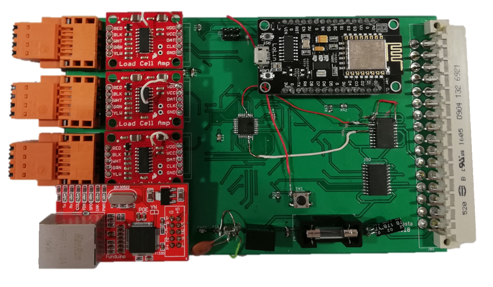

# WeighersandWebsites
Software developed for a weighing board based on ATmega328 micro-controller and NodeMCU-ESP8266 for wifi conections with database in remote server. 
The module (see figure below) comunicates by ModBus IP Protocol with the application in C# made in Visual Studio. 

# Hardware
The code was used to program an Arduino Uno and a NodeMCU-ESP8266 for comand of a weighing module to be incorporated in a Checkweigher or any kind of fruit sorters.
Its composed by 3 [sparkfun load cell amplifiers](https://www.sparkfun.com/products/13879) and one [ENC28J60  ethernet shield](https://www.banggood.com/Mini-W5100-Ethernet-Network-Module-Board-For-Arduino-p-982664.html?rmmds=buy&cur_warehouse=CN) for ethernet conections and ModBus IP comunication.

# Software
The software was developed for 4 platforms (Arduino, NodeMCU, C# aplication and php files).

(in progress...)
