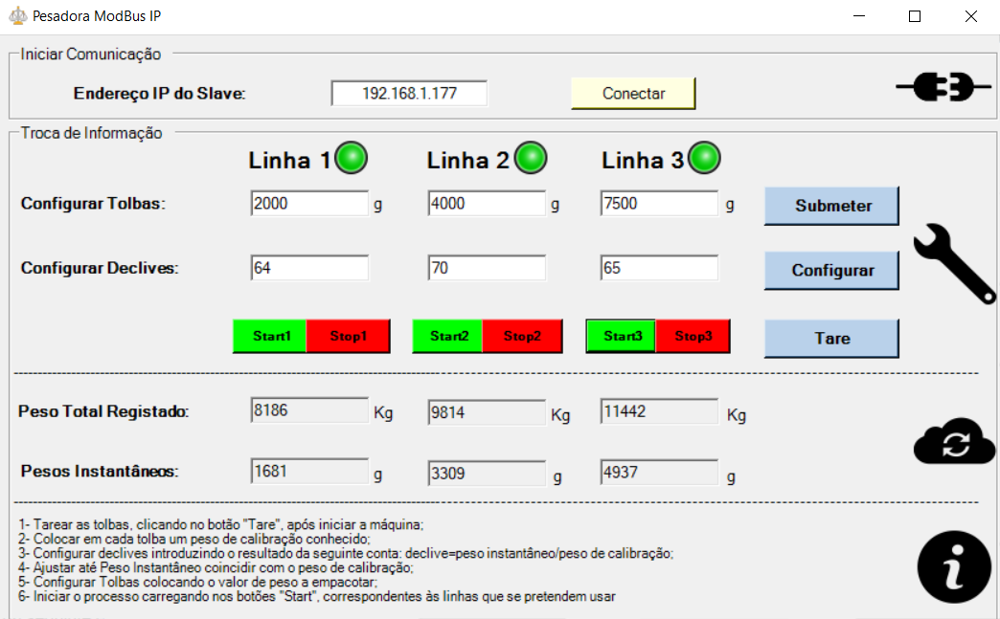

# WeighersandWebsites
## Overview
Software developed for a weighing board based on **ATmega328** micro-controller and **NodeMCU-ESP8266** for wifi conections with database in remote server.  
The module (see figure 1) comunicates by **ModBus IP** Protocol with Windows client application made in C# (.Net Framework) or with a general use ModBus IP application like _ModBus Doctor_.

 

 <figcaption> 
Fig. 1 - Weighing board 
</figcaption>
 

## Hardware
The board outline was an "Euroboard 160mmx100mm holes" and its mainly composed by: 
1. 3x Weidmuller OMNIMATE Signal - series B2C/S2C 3.50 - 2-row B2CF 3.50/08/180F SN OR BX;
2. 3x [sparkfun load cell amplifiers](https://www.sparkfun.com/products/13879);
3. [ENC28J60  ethernet shield](https://www.banggood.com/Mini-W5100-Ethernet-Network-Module-Board-For-Arduino-p-982664.html?rmmds=buy&cur_warehouse=CN) for ethernet conections and ModBus IP comunication;
4. ICSP Header for in-circuit programming of the ATmega chip;
5. ATmega 328 (SMD version);
6. NodeMCU v3 - ESP8266;
7. Traco Power DC-DC Converter (TSR 1-2450);
8. Fuse 24V1A;
9. Reset Button;
10. Infineon Smart High-Side Power Switch (its716g);
11. Harting  Eurocard - 09041326921 (DIN 41612);
12. Power LED.

## Software
The software was developed for 4 platforms, including:
+ ATmega328 for control of the process; [a relative link](https://github.com/joaolrc/WeighersandWebsites/blob/master/CODE/MCUs/sorter_test/atmega/sorter_test.ino)
)
+ NodeMCU-ESP8266 for Wi-Fi conections;
+ .Net aplication for local or remote control and supervision of the process (see figure 2);
+ PHP files for data inserting and WEB pages for supervision of the process (see figures 3 and 4)

 

 <figcaption> 
Fig. 2 - Microsoft .Net application developed 
</figcaption>
 

 

 <figcaption> 
Fig. 3 - Initial Page (index.php) 
</figcaption>
 

 
 

 <figcaption> 
Fig. 4 - Home Page (home.php) 
</figcaption>
 

(in progress...)
